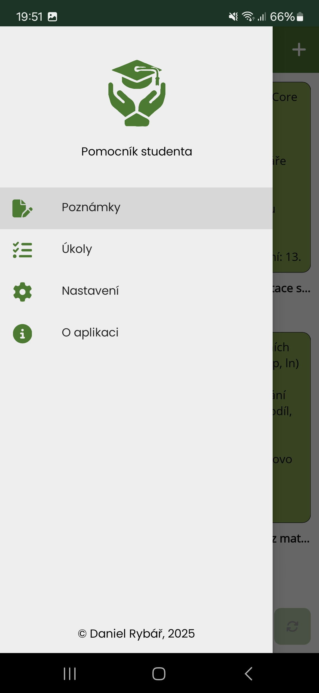
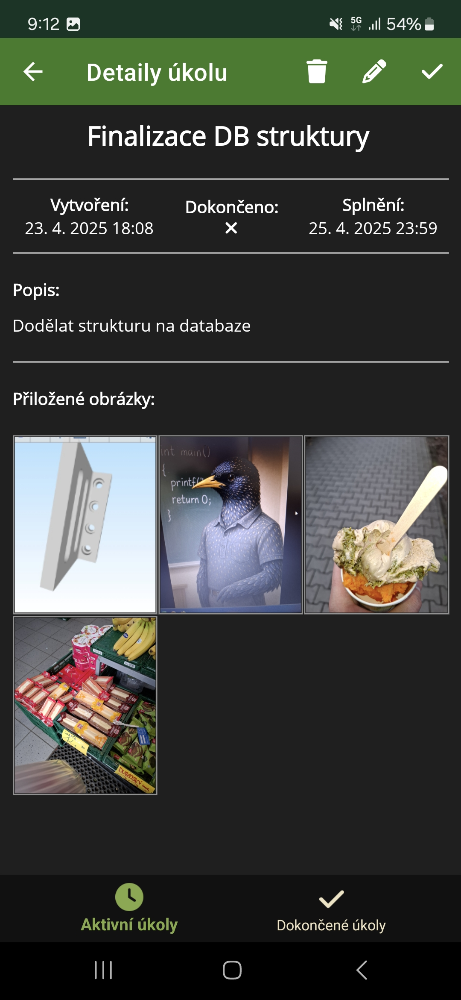
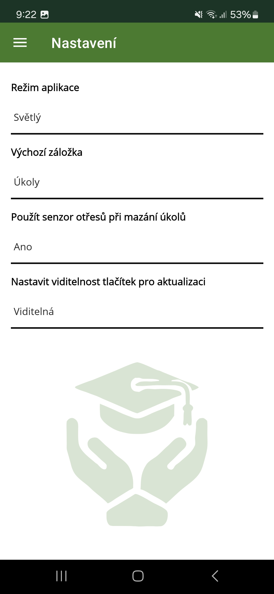

# Pomocník studenta
Aplikace vytvořená v rámci bakalářského projektu na Technické univerzitě v Liberci během druhého semestru akademického roku 2024/25.

## Použitá technologie a požadavky
* Aplikace byla vyvinuta pomocí frameworku [.NET MAUI 9](https://learn.microsoft.com/cs-cz/dotnet/maui/what-is-maui?view=net-maui-9.0)
* Minimální verze Androidu: **10 (API 29)**

## Instalace
- Nejnovější verze aplikace (tedy i APK soubor) je k dispozici ke stažení na [GitHub Releases](https://github.com/DanielRybar/StudentsHelper/releases)
- Pro instalaci aplikace je třeba povolit instalaci z neznámých zdrojů (protože APK soubor není distribuován přes Google Play)

## Vybrané screenshoty z aplikace

### Navigace aplikace (Shell)

| Světlý režim | Tmavý režim |
|-------------|-------------|
|  |  |

### Modul Poznámkový blok

| Světlý režim | Tmavý režim |
|-------------|-------------|
|  |  |
|  |  |

### Modul Úkoly

| Světlý režim | Tmavý režim |
|-------------|-------------|
|  |  |
|  |  |
|  |  |
|  |  |
|  |  |

### Modul Nastavení

| Světlý režim | Tmavý režim |
|-------------|-------------|
|  |  |

### Modul O aplikaci

| Světlý režim | Tmavý režim |
|-------------|-------------|
|  |  |
